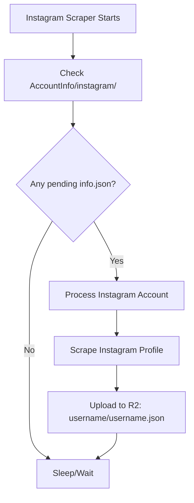
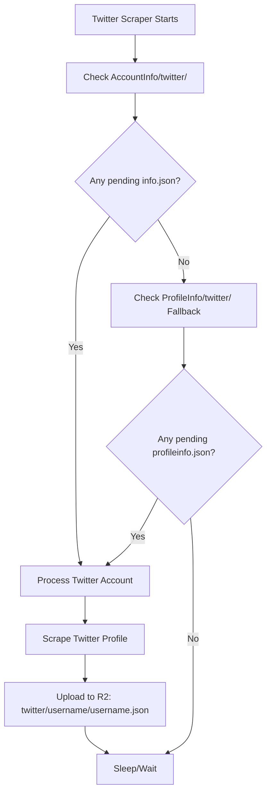

# Platform Separation Architecture - Fixed Implementation

## Issue Identified and Resolved

### The Problem
The original implementation had a **critical architectural flaw** where both Instagram and Twitter scrapers were processing account info files from all platforms, causing:

1. **Cross-platform contamination**: Instagram scraper was processing Twitter accounts
2. **Efficiency loss**: Both scrapers scanning the same `AccountInfo/` directory
3. **Future scalability issues**: No clean separation for adding new platforms
4. **Data integrity risks**: Wrong scraper processing wrong platform data

### The Solution: Strict Platform Separation

## New Directory Structure

### Primary Architecture (Standardized)
```
tasks/
├── AccountInfo/
│   ├── instagram/
│   │   └── <username>/
│   │       └── info.json          # ✅ Instagram scraper ONLY
│   └── twitter/
│       └── <username>/
│           └── info.json            # ✅ Twitter scraper PRIMARY
```

### Platform Processing Rules

#### Instagram Scraper
- **PRIMARY LOOKUP**: `AccountInfo/instagram/<username>/info.json`
- **SCOPE**: Only Instagram accounts
- **METHOD**: `retrieve_and_process_usernames()`
- **PREFIX**: `"AccountInfo/instagram/"`

#### Twitter Scraper  
- **PRIMARY LOOKUP**: `AccountInfo/twitter/<username>/info.json`
- **FALLBACK LOOKUP**: `ProfileInfo/twitter/<username>/profileinfo.json`
- **SCOPE**: Only Twitter accounts
- **METHOD**: `retrieve_and_process_twitter_usernames()`
- **PRIMARY PREFIX**: `"AccountInfo/twitter/"`
- **FALLBACK PREFIX**: `"ProfileInfo/twitter/"`

#### Main System (ContentRecommendationSystem)
- **PLATFORM-SPECIFIC**: `AccountInfo/<platform>/<username>/info.json`
- **METHOD**: `_find_unprocessed_account_info(platform)`
- **DYNAMIC PREFIX**: `f"AccountInfo/{platform}/"`

## Implementation Details

### 1. Instagram Scraper Changes

**File**: `instagram_scraper.py`

**Before (PROBLEMATIC)**:
```python
prefix = "AccountInfo/"  # ❌ Processed ALL platforms
```

**After (FIXED)**:
```python
prefix = "AccountInfo/instagram/"  # ✅ Instagram accounts ONLY
```

**Key Methods Updated**:
- `retrieve_and_process_usernames()` - Now platform-specific
- `_check_for_new_pending_files()` - Instagram directory only

### 2. Twitter Scraper Changes

**File**: `twitter_scraper.py`

**Before (MIXED APPROACH)**:
```python
prefix = "ProfileInfo/twitter/"  # Primary
# Multiple fallback attempts
```

**After (STANDARDIZED WITH FALLBACK)**:
```python
primary_prefix = "AccountInfo/twitter/"      # ✅ Primary (standardized)
fallback_prefix = "ProfileInfo/twitter/"     # ✅ Fallback (backward compatibility)
```

**Key Methods Updated**:
- `retrieve_and_process_twitter_usernames()` - Standard + fallback approach
- `_check_for_new_pending_twitter_files()` - Both prefixes checked

### 3. Main System Consistency

**File**: `main.py`

**Already Correct** (No changes needed):
```python
prefix = f"AccountInfo/{platform}/"  # ✅ Platform-specific from start
```

## Platform Processing Flow

### Instagram Account Processing


### Twitter Account Processing


## Strict Isolation Benefits

### 1. **No Cross-Platform Processing**
- Instagram scraper: `AccountInfo/instagram/` **ONLY**
- Twitter scraper: `AccountInfo/twitter/` + `ProfileInfo/twitter/` **ONLY**
- Zero overlap or contamination

### 2. **Clean Platform Addition**
Adding a new platform (e.g., LinkedIn):
```
AccountInfo/linkedin/<username>/info.json  # New platform directory
```

### 3. **Performance Optimization**
- Each scraper scans minimal, relevant directories
- No wasted cycles processing wrong platform files
- Parallel processing without conflicts

### 4. **Data Integrity**
- Platform-specific data processing
- Correct actor APIs for each platform
- Proper data formatting per platform

## Testing and Validation

### Automated Testing
**File**: `test_platform_separation.py`

**Tests Include**:
1. ✅ Directory structure separation validation
2. ✅ Main system platform separation
3. ✅ Prefix validation  
4. ✅ Pending files separation
5. ✅ Cross-platform validation simulation

**All Tests Passing**: 5/5 ✅

### Manual Validation Commands
```bash
# Test platform separation
python test_platform_separation.py

# Test Instagram scraper (isolated)
python instagram_scraper.py

# Test Twitter scraper (isolated)  
python twitter_scraper.py

# Test main system sequential processing
python test_sequential_processing.py
```

## File Upload Standards

### Instagram Account Upload Format
```json
// AccountInfo/instagram/<username>/info.json
{
    "username": "instagram_username",
    "accountType": "branding|non-branding", 
    "postingStyle": "promotional|educational|entertaining|informative",
    "competitors": ["competitor1", "competitor2"],
    "status": "pending|processing|processed|failed",
    "timestamp": "2025-01-01T00:00:00Z"
}
```

### Twitter Account Upload Format
```json
// AccountInfo/twitter/<username>/info.json  
{
    "username": "twitter_username",
    "accountType": "personal|business|creator",
    "postingStyle": "informative|opinion|news|entertainment", 
    "competitors": ["competitor1", "competitor2"],
    "status": "pending|processing|processed|failed",
    "timestamp": "2025-01-01T00:00:00Z"
}
```

## Storage Output Separation

### Instagram Storage Paths
```
main-bucket/
├── <username>/
│   ├── <username>.json        # Primary account data
│   ├── competitor1.json       # Competitor data
│   └── competitor2.json

tasks/
├── ProfileInfo/<username>.json  # Short profile info
└── ProcessedInfo/<username>.json # Processing metadata
```

### Twitter Storage Paths  
```
main-bucket/
├── twitter/
│   └── <username>/
│       ├── <username>.json    # Primary account data
│       ├── competitor1.json   # Competitor data
│       └── competitor2.json

tasks/
├── ProfileInfo/twitter/<username>/profileinfo.json  # Short profile info
└── ProcessedInfo/<username>.json # Processing metadata
```

## Architecture Guarantees

### ✅ Strict Platform Isolation
- **Instagram scraper** → **Instagram accounts ONLY**
- **Twitter scraper** → **Twitter accounts ONLY**  
- **Main system** → **Platform-specific processing**

### ✅ Future-Proof Design
- Clean platform addition without touching existing code
- Scalable directory structure
- Consistent API patterns

### ✅ Backward Compatibility
- Twitter scraper maintains `ProfileInfo/twitter/` fallback
- Existing Twitter accounts continue working
- Smooth migration path

### ✅ Zero Cross-Contamination Risk
- No shared directories between platforms
- Platform-specific prefixes enforced
- Isolated processing pipelines

## Migration Guide

### For Existing Twitter Accounts
If you have accounts in the old format:
```
ProfileInfo/twitter/<username>/profileinfo.json  # Old format (still works)
```

**Recommended Migration**:
```
AccountInfo/twitter/<username>/info.json  # New standardized format
```

### For New Accounts
**Instagram**: Use `AccountInfo/instagram/<username>/info.json`
**Twitter**: Use `AccountInfo/twitter/<username>/info.json`

## Summary

This architectural fix ensures:
1. **Complete platform separation** - No cross-platform processing
2. **Future scalability** - Clean addition of new platforms
3. **Performance optimization** - Targeted directory scanning
4. **Data integrity** - Platform-specific processing pipelines
5. **Backward compatibility** - Existing Twitter accounts still work

The system now operates with **strict platform isolation** while maintaining all existing functionality and providing a clear path for future platform additions. 